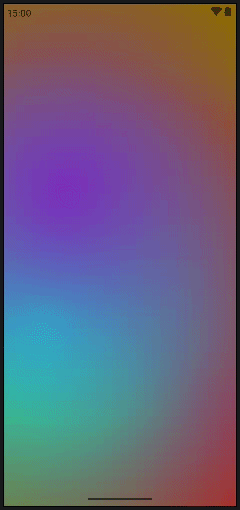

# 🌊 FluidBackground

A high-performance, vibrant, and interactive fluid background component built with **Jetpack Compose** and **AGSL (Android Graphics Shading Language)**.

`FluidBackground` brings smooth, organic, fluid-dynamics shader animations to Android apps. It utilizes domain-warped curl noise and 3D specular sheen on Android 13+ (API 33+), while offering a smooth animated fallback for older Android versions (API 24+).

---

## 🎥 Preview

Below are live recordings of the dynamic fluid shader background in action:

<p align="center">
  
</p>

---

## ✨ Features

- 🎨 **AGSL Runtime Shader Physics**: Domain-warped multi-octave Curl Noise field with physical liquid vortex dynamics, specular sheen, swirl highlights, and vignette effect.
- 🌈 **4-Color Palette Customization**: Full control over primary, secondary, highlight, and dark background tones.
- ⚡ **High Performance & Band-Free**: Includes spatial dithering to eliminate gradient color banding.
- 🛡️ **Graceful Fallback System**: Automatic switch to an animated multi-blob radial gradient canvas engine on API levels 24 to 32.
- 📦 **Simple API**: Use `FluidScreen` as a full-screen layout container or `FluidBackground` as a standalone composable.

---

## 🚀 Quick Start

### 1. Full Screen Layout with `FluidScreen`

Wrap your screen content directly inside `FluidScreen`:

```kotlin
import androidx.compose.foundation.layout.Box
import androidx.compose.foundation.layout.fillMaxSize
import androidx.compose.material3.Text
import androidx.compose.runtime.Composable
import androidx.compose.ui.Alignment
import androidx.compose.ui.Modifier
import androidx.compose.ui.graphics.Color
import androidx.compose.ui.text.font.FontWeight
import androidx.compose.ui.unit.sp
import com.bitbytestudio.fluidbackground.ui.FluidScreen

@Composable
fun MyFluidScreen() {
    FluidScreen(
        color1 = Color(0xFF0A0E2A), // Deep Midnight
        color2 = Color(0xFF00F5D4), // Bright Cyan
        color3 = Color(0xFF7B2CBF), // Electric Purple
        color4 = Color(0xFF03045E), // Deep Blue Base
        speed = 0.45f,             // Motion animation speed multiplier
        intensity = 0.7f            // Distortion & swirl intensity
    ) {
        Box(
            modifier = Modifier.fillMaxSize(),
            contentAlignment = Alignment.Center
        ) {
            Text(
                text = "Fluid Background",
                fontSize = 32.sp,
                fontWeight = FontWeight.Bold,
                color = Color.White
            )
        }
    }
}
```

### 2. Custom Background View with `FluidBackground`

Apply `FluidBackground` to any container or component:

```kotlin
import androidx.compose.foundation.layout.Box
import androidx.compose.foundation.layout.fillMaxSize
import androidx.compose.runtime.Composable
import androidx.compose.ui.Modifier
import androidx.compose.ui.graphics.Color
import com.bitbytestudio.fluidbackground.ui.FluidBackground

@Composable
fun CustomBackgroundContainer() {
    Box(modifier = Modifier.fillMaxSize()) {
        FluidBackground(
            modifier = Modifier.fillMaxSize(),
            color1 = Color(0xFFB90845),
            color2 = Color(0xFF00F5D4),
            color3 = Color(0xFF7B2CBF),
            color4 = Color(0xFF8C6B05),
            speed = 0.5f,
            intensity = 0.8f
        )
        // Your content here
    }
}
```

---

## ⚙️ Parameters

### `FluidScreen` / `FluidBackground`

| Parameter | Type | Default Value | Description |
| :--- | :--- | :--- | :--- |
| `modifier` | `Modifier` | `Modifier` | Layout modifier applied to the container. |
| `color1` | `Color` | `Color(0xFF0A0E2A)` | Primary fluid color flow layer. |
| `color2` | `Color` | `Color(0xFF00F5D4)` | Secondary fluid wave color layer. |
| `color3` | `Color` | `Color(0xFF7B2CBF)` | Highlight color swirl accent layer. |
| `color4` | `Color` | `Color(0xFF03045E)` | Deep background base tint layer. |
| `speed` | `Float` | `0.45f` | Animation speed factor (higher = faster animation). |
| `intensity` | `Float` | `1.0f` | Fluid distortion and domain warping intensity. |
| `content` | `@Composable () -> Unit` | `{}` | Optional content rendered on top of the fluid background (`FluidScreen` only). |

---

## 🛠️ Requirements & Specifications

- **Minimum SDK**: API 24 (Android 7.0 Nougat)
- **Target SDK**: API 37
- **AGSL Shader Support**: Native hardware AGSL RuntimeShader on API 33+ (Android 13 Tiramisu)
- **Fallback Engine**: Multi-blob radial canvas drawing on API 24–32
- **Language**: Kotlin & Jetpack Compose

---

## 📁 Repository Structure

```
FluidBackground/
├── app/src/main/java/com/bitbytestudio/fluidbackground/
│   ├── MainActivity.kt                  # Sample Application Activity
│   ├── Shader/
│   │   └── Shader.kt                    # AGSL Runtime Shader GLSL code (Curl noise & warping)
│   └── ui/
│       ├── FluidBackground.kt           # Main Entry Composable (handles API detection)
│       ├── FluidShaderBackground.kt     # AGSL RuntimeShader implementation (API 33+)
│       └── FluidFallbackBackground.kt   # Radial gradient canvas fallback engine (API < 33)
└── demo/
    ├── Screencast From 2026-10-01 11-07-10.webm
    └── Screencast From 2026-10-01 11-10-52.webm
```

---

## 📄 License

Copyright 2026 BitByteStudio

Licensed under the Apache License, Version 2.0 (the "License");
you may not use this file except in compliance with the License.
You may obtain a copy of the License at

    http://www.apache.org/licenses/LICENSE-2.0

Unless required by applicable law or agreed to in writing, org
software distributed under the License is distributed on an "AS IS" BASIS,
WITHOUT WARRANTIES OR CONDITIONS OF ANY KIND, either express or implied.
See the License for the specific language governing permissions and
limitations under the License.
